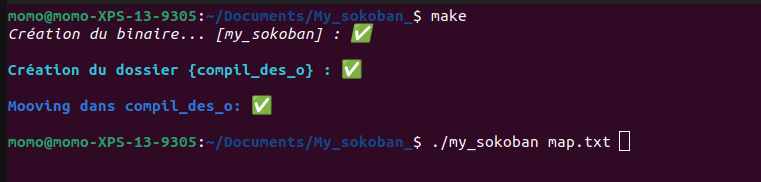
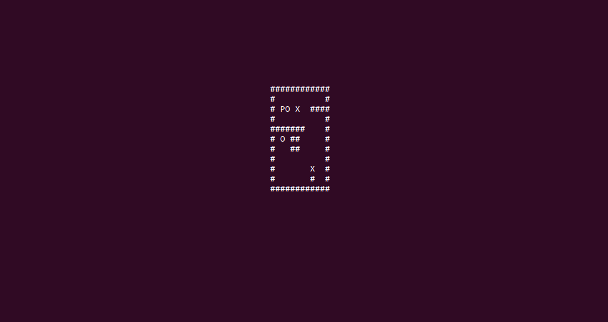

# Dante's Star

Le but de ce projet est de créer un jeu en utilisant la librairie Ncurses, qui sera un jeu pouvant être joué sur n'importe quel terminal sous Linux. Le Sokoban (gardien d'entrepôt en japonais) est un jeu, dans lequel le joueur représenté par la 'P' pousse des caisses représentées par des 'X' dans un espace des espaces de stockage représenté par des 'O'.

Le joueur 'P' peut se déplacer horizontalement ou verticalement sur des espaces vides, sans traverser les murs ou des caisses. Les caisses doivent avoir des aspects physiques, c'est-à-dire qu'elles ne peuvent pas être poussé dans d'autres boîtes ou murs. Le jeu doit avoir des conditions de "Win" et "Lose". La partie est gagnée lorsque toutes les caisses seront dans des espaces de stockage et la partie est perdue lorsqu'une caisse se retrouve coincée.

## But du programme

My_sokoban : Poussez et placer toutes les caisses dans un espaces de stockage.

## Fonctions autorisées

```
	. Toute la libC
	. Librairie Ncurses
```

## Mise en route

Ces instructions vous permettront d'obtenir une copie du projet opérationnel sur votre machine locale à des fins de développement et de test.

### Pré-requis

De quoi avez-vous besoin pour installer le logiciel et comment l'installer ?

```
gcc
make
```

### Installation

Compilation du projet

```
make
```

Lancement du projet

```
./my_sokoban map.txt

```

## Captures d'écrans

Compilation :


Lancement du Jeu :



